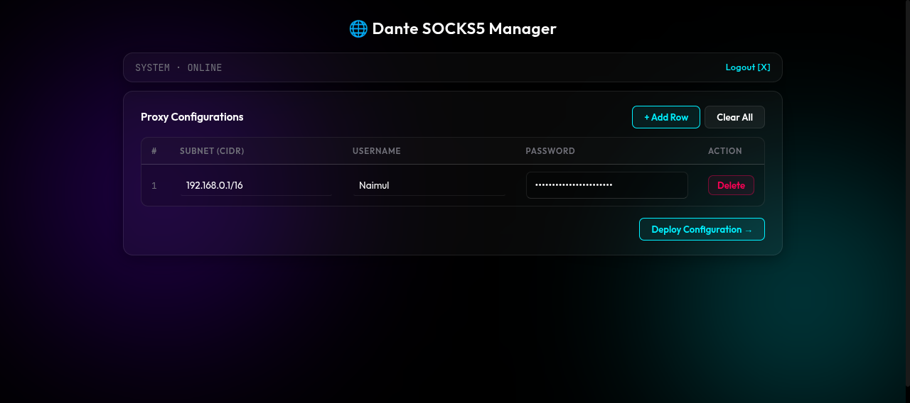

<div align="center">

<h1>Simple DantD UI</h1>

<p>A lightweight, modern web dashboard for managing your Dante SOCKS5 proxy server.<br>
Configure subnets, manage Linux proxy users, write config, and test connectivity — all from the browser.</p>

<p>
  <a href="https://github.com/mdnaimul22/simple-dantd"></a>
  
  
  
  <a href="./LICENSE"></a>
</p>

<p>
  <a href="#quick-start">Quick Start</a> •
  <a href="#features">Features</a> •
  <a href="#project-structure">Structure</a> •
  <a href="#environment-variables">Config</a> •
  <a href="#running-on-a-production-server">Production</a> •
  <a href="#development">Development</a>
</p>

</div>

## Features

- 🔐 **Secure admin login** — credentials from `.env`, session-based auth
- 🌐 **Subnet management** — add, edit, delete allowed client CIDR ranges
- 👥 **Linux user management** — automatically creates/updates system users in group `danteproxy`
- ⚙️ **Config deployment** — writes `/etc/danted.conf` and restarts `danted` via sudo
- 🧪 **Built-in connectivity tests** — verifies each proxy user after deployment via `curl socks5h://`
- 💾 **Persistent state** — configuration saved to `profiles_data/profiles.json`
- 🎨 **Modern UI** — glassmorphic dark-mode interface, no scroll on desktop

## Screenshot

<div align="center">
  
</div>

## Quick Start

### 1 — Clone and set up environment

```bash
git clone https://github.com/mdnaimul22/simple-dantd.git
cd simple-dantd

python3 -m venv .venv
source .venv/bin/activate
pip install -e ".[dev]"
```

### 2 — Configure

```bash
cp .env.example .env
# Edit .env — at minimum set a strong DANTE_UI_SECRET
```

`.env` reference:

```ini
ADMIN_USER=admin
ADMIN_PASS=admin
DANTE_UI_SECRET=change-me-in-production
APP_HOST=127.0.0.50
APP_PORT=7000
```

### 3 — Bind the loopback alias (once per boot)

```bash
sudo ip addr add 127.0.0.50/32 dev lo
```

To persist across reboots add a `systemd-networkd` or `/etc/rc.local` entry.

### 4 — Run

```bash
python main.py
# or explicitly:
uvicorn main:app --host 127.0.0.50 --port 7000
```

Open **http://127.0.0.50:7000** and log in with your admin credentials.

## Running on a Production Server

The UI performs privileged operations (write `/etc/danted.conf`, `useradd`, `systemctl restart danted`). On a real server run with one of these approaches:

**Option A — Run as root (simplest)**

```bash
sudo python main.py
```

**Option B — Configure NOPASSWD sudoers**

```bash
sudo visudo
# Add (replace <username> with your user):
<username> ALL=(ALL) NOPASSWD: ALL
```

> [!NOTE]
> In restricted environments (IDE sandbox, containers with `NoNewPrivs=1`) sudo is blocked at the kernel level and system operations will fail gracefully with a descriptive error. Profile state is still saved.

## Using the Dashboard

1. Log in with your admin credentials.
2. Click **+ Add Row** to add a proxy configuration (subnet, username, password).
3. Click **Deploy Configuration →** — you will be prompted for your sudo password.
4. After deployment the app restarts `danted`, then tests each user's SOCKS5 connectivity and shows results.

## Prerequisites

| Requirement | Notes |
|---|---|
| Linux (Ubuntu/Debian recommended) | Tested on Ubuntu 22.04+ |
| Python 3.11+ | virtualenv recommended |
| `danted` installed | e.g. `sudo apt install dante-server` |
| `curl` | used for connectivity tests |
| sudo access | required for config writes and service management |

## Environment Variables

All variables are read from `.env` (see `.env.example`):

| Variable | Default | Description |
|---|---|---|
| `ADMIN_USER` | `admin` | Web UI login username |
| `ADMIN_PASS` | `admin` | Web UI login password |
| `DANTE_UI_SECRET` | `change-me-secret` | Session signing key — **must be changed in production** |
| `APP_HOST` | `127.0.0.50` | Bind address |
| `APP_PORT` | `7000` | Bind port |

## Project Structure

```
simple-dantd/
├── main.py                        # FastAPI app entry point
├── pyproject.toml                 # Dependencies and pytest config
├── .env.example                   # Environment variable template
│
├── src/
│   ├── config/                    # Single source of truth — AppConfig (Pydantic BaseSettings)
│   ├── schema/                    # Data contracts — ProxyEntry, TestResult, APIStateResponse
│   ├── providers/                 # OS-level operations (subprocess, user management)
│   │   ├── system.py              # run_cmd_async, sudo wrapper, network helpers
│   │   └── user_manager.py        # ensure_user, delete_user, list_proxy_users
│   ├── services/                  # Business logic
│   │   ├── state.py               # Load/save profiles_data/profiles.json
│   │   ├── dante.py               # Generate and write /etc/danted.conf
│   │   └── deployment.py          # Orchestrates deploy + test flow
│   └── api/
│       └── routes.py              # FastAPI routes (login, dashboard, /save, /api/state)
│
├── web/
│   ├── templates/                 # Jinja2 HTML templates
│   │   ├── login.html
│   │   ├── index.html             # Dashboard
│   │   └── result.html            # Deployment results
│   └── static/
│       └── style.css              # Glassmorphic dark-mode CSS design system
│
├── tests/
│   ├── conftest.py                # Shared fixtures
│   ├── test_api/test_routes.py    # Route / auth tests
│   ├── test_providers/test_system.py
│   └── test_services/test_state.py
│
└── profiles_data/
    └── profiles.json              # Persisted proxy configurations (auto-created)
```

## Development

```bash
# Install with dev dependencies
pip install -e ".[dev]"

# Run all tests with coverage
python -m pytest tests/ -v

# Run the dev server with auto-reload
uvicorn main:app --host 127.0.0.50 --port 7000 --reload
```

### Architecture

The project follows **Clean Architecture** with a strict layered dependency model:

```
Config / Schema  ←  no local imports (foundation)
    ↑
Providers        ←  OS/external integrations only
    ↑
Services         ←  business logic, orchestrates providers
    ↑
API (routes)     ←  HTTP interface, calls services only
```

## API Reference

| Method | Path | Description |
|---|---|---|
| `GET` | `/` | Dashboard (requires auth) |
| `GET` | `/login` | Login page |
| `POST` | `/login` | Submit credentials |
| `GET` | `/logout` | Clear session |
| `POST` | `/save` | Deploy configuration |
| `GET` | `/api/state` | JSON state dump (subnets, users, entries) |

## License

This project is licensed under the MIT License — see the [LICENSE](./LICENSE) file for details.
